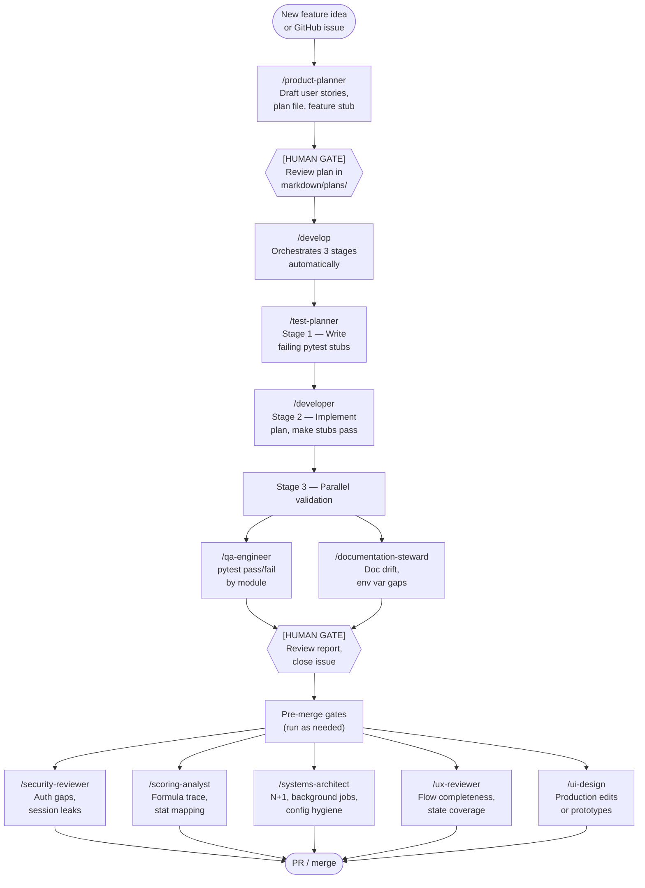

# Developer Agents

Slash commands in this directory define role-based agents for the project. Invoke them
in Claude Code by typing the command name (e.g. `/develop plan-slug`).

All agents declare their scope, check preconditions before doing deep work, and produce
a defined output format. Each file starts with `<!-- version: N -->` and
`<!-- mode: read-only | read-write -->` headers.

---

## Development pipeline

The standard path from idea to merged code:



---

## Agent reference

### Pipeline agents (used on every feature)

| Agent | Mode | Role |
|---|---|---|
| [`/product-planner`](product-planner.md) | read-write | Formalises a feature: writes plan file, user stories, and feature stub. Entry point for all new work. |
| [`/develop`](develop.md) | read-write | Orchestrates the full 3-stage pipeline: test stubs → implementation → QA + docs. Use this instead of running the three stages manually. |
| [`/test-planner`](test-planner.md) | read-write | Writes failing pytest stubs from a plan's acceptance criteria. Called by `/develop` Stage 1; can be run standalone. |
| [`/developer`](developer.md) | read-write | Implements a plan and makes the test stubs pass. Called by `/develop` Stage 2; can be run standalone. |
| [`/qa-engineer`](qa-engineer.md) | read-only | Runs `pytest` and reports results grouped by module. Called by `/develop` Stage 3; also useful after any ad-hoc backend change. |
| [`/documentation-steward`](documentation-steward.md) | read-only | Detects drift between `markdown/features/` and the backend. Called by `/develop` Stage 3; run before writing a new plan. |

### Review gates (run before merging)

| Agent | Trigger | Focus |
|---|---|---|
| [`/security-reviewer`](security-reviewer.md) | Any change to `backend/` routers or `main.py` | Auth gaps, session leaks, input validation, data over-exposure |
| [`/scoring-analyst`](scoring-analyst.md) | Changes to `scoring.py`, `enrich.py`, or `WEIGHTS_JSON` | Formula correctness, stat-key mapping, division-by-zero |
| [`/ux-reviewer`](ux-reviewer.md) | Any significant frontend change | Flow completeness, state coverage, consistency, accessibility |
| [`/ui-design`](ui-design.md) | New UI surface or brand/design change | Brand-compliant production edits or throwaway prototypes |
| [`/systems-architect`](systems-architect.md) | Before a major refactor or new subsystem | N+1 queries, background job resilience, config hygiene |

### Maintenance agents

| Agent | When to run | Focus |
|---|---|---|
| [`/product-analyst`](product-analyst.md) | After a sprint or milestone | Maps every user story to implementation; surfaces gaps |
| [`/agent-steward`](agent-steward.md) | After file renames, endpoint changes, or before a planning session | Validates agent definitions aren't stale; updates this README |

---

## Recommended session start

```
/agent-steward          # ensure agent definitions and this README are current
/product-planner <desc> # plan the work
/develop <plan-slug>    # implement it
```
