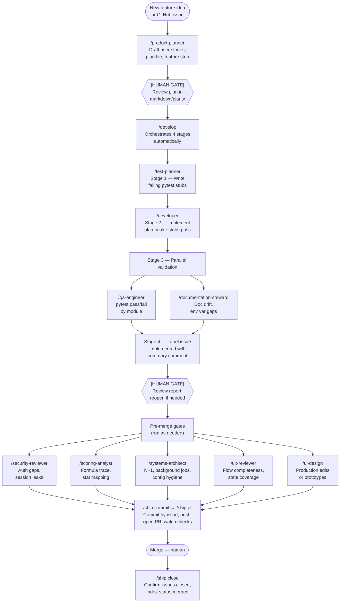

# Developer Agents

Slash commands in this directory define role-based agents for the project. Invoke them
in Claude Code by typing the command name (e.g. `/develop plan-slug`).

All agents declare their scope, check preconditions before doing deep work, and produce
a defined output format. Each file starts with `<!-- version: N -->` and
`<!-- mode: read-only | read-write -->` headers.

Two conventions keep the process in commands rather than in mid-run questions:
- **The invocation is the consent.** Running a command authorises what its description says it does; options are arguments (`--dry-run`, `apply`, `fix`, `--fix`). When input is missing or a choice can't be made from the repo, the agent stops and prints the invocations that express each choice.
- **Every run ends with `Next:`** and one ready-to-run invocation that continues the work.

---

## Development pipeline

The standard path from idea to merged code:


```mermaid
flowchart TD
    IDEA([New feature idea\nor GitHub issue])

    PLAN["/product-planner\nDraft user stories,\nplan file, feature stub"]

    REVIEW_PLAN{{"[HUMAN GATE]\nReview plan in\nmarkdown/plans/"}}

    DEVELOP["/develop\nOrchestrates 4 stages\nautomatically"]

    STUBS["/test-planner\nStage 1 — Write\nfailing pytest stubs"]

    IMPL["/developer\nStage 2 — Implement\nplan, make stubs pass"]

    VALID["Stage 3 — Parallel validation"]

    QA["/qa-engineer\npytest pass/fail\nby module"]

    DOCS["/documentation-steward\nDoc drift,\nenv var gaps"]

    CLOSE["Stage 4 — Label issue\nimplemented with\nsummary comment"]

    REVIEW_CODE{{"[HUMAN GATE]\nReview report,\nreopen if needed"}}

    GATES["Pre-merge gates\n(run as needed)"]

    SEC["/security-reviewer\nAuth gaps,\nsession leaks"]

    SCORE["/scoring-analyst\nFormula trace,\nstat mapping"]

    ARCH["/systems-architect\nN+1, background jobs,\nconfig hygiene"]

    UX["/ux-reviewer\nFlow completeness,\nstate coverage"]

    UI["/ui-design\nProduction edits\nor prototypes"]

    SHIP["/ship commit → /ship pr\nCommit by issue, push,\nopen PR, watch checks"]

    MERGE([Merge — human])

    SHIPCLOSE["/ship close\nConfirm issues closed,\nindex status merged"]

    IDEA --> PLAN
    PLAN --> REVIEW_PLAN
    REVIEW_PLAN --> DEVELOP
    DEVELOP --> STUBS --> IMPL --> VALID
    VALID --> QA
    VALID --> DOCS
    QA --> CLOSE
    DOCS --> CLOSE
    CLOSE --> REVIEW_CODE
    REVIEW_CODE --> GATES
    GATES --> SEC
    GATES --> SCORE
    GATES --> ARCH
    GATES --> UX
    GATES --> UI
    SEC --> SHIP
    SCORE --> SHIP
    ARCH --> SHIP
    UX --> SHIP
    UI --> SHIP
    SHIP --> MERGE --> SHIPCLOSE
```

---

## Agent reference

### Pipeline agents (used on every feature)

| Agent | Mode | Role |
|---|---|---|
| [`/product-planner`](product-planner.md) | read-write | Formalises a feature: writes plan file, user stories, and feature stub. Entry point for all new work. |
| [`/develop`](develop.md) | read-write | Orchestrates the full pipeline: test stubs → implementation → QA + docs → labels the source GitHub issue `implemented` with a summary comment when every stage passes (the issue stays open until merged). Adds `/security-reviewer` to Stage 3 when the change touches security-sensitive code; a High finding blocks the issue update. Use this instead of running the stages manually. |
| [`/ship`](ship.md) | read-write | The GitHub side after `/develop`: `status` (where every issue stands), `commit` (one commit per issue), `pr` (push, open PR with `Closes #N`, watch CI and code scanning, `--fix all|<N,...>` fixes alerts via the `/security-patcher` workflow), `sync <N>` (issue text follows plan scope changes), `close` (confirm issues closed after merge). Running a subcommand is the consent for what it does; `--dry-run` shows it without doing it. Never merges or force-pushes. |
| [`/test-planner`](test-planner.md) | read-write | Writes failing pytest stubs from a plan's acceptance criteria. Called by `/develop` Stage 1; can be run standalone. |
| [`/developer`](developer.md) | read-write | Implements a plan and makes the test stubs pass. Called by `/develop` Stage 2; can be run standalone. |
| [`/qa-engineer`](qa-engineer.md) | read-only | Runs `pytest` and reports results grouped by module. Called by `/develop` Stage 3; also useful after any ad-hoc backend change. |
| [`/documentation-steward`](documentation-steward.md) | read-only | Detects drift between `markdown/features/` and the backend. Called by `/develop` Stage 3; run before writing a new plan. |

### Review gates (run before merging)

| Agent | Trigger | Focus |
|---|---|---|
| [`/security-reviewer`](security-reviewer.md) | Any change to `backend/` routers or `main.py` (run automatically by `/develop` for security-sensitive changes) | Auth gaps, session leaks, input validation, data over-exposure; `/security-reviewer fix` applies the fixes for the last review's High and Medium findings |
| [`/security-patcher`](security-patcher.md) | New GitHub code scanning alert (default branch or open PR); also run by `/ship pr` for its PR's alerts | Fetches alert, fixes flagged code, verifies tests pass; with no argument lists open alerts including those on PRs |
| [`/scoring-analyst`](scoring-analyst.md) | Changes to `scoring.py`, `enrich.py`, or `WEIGHTS_JSON` | Formula correctness, stat-key mapping, division-by-zero |
| [`/ux-reviewer`](ux-reviewer.md) | Any significant frontend change | Flow completeness, state coverage, consistency, accessibility |
| [`/ui-design`](ui-design.md) | New UI surface or brand/design change | Brand-compliant production edits or throwaway prototypes |
| [`/systems-architect`](systems-architect.md) | Before a major refactor or new subsystem | N+1 queries, background job resilience, config hygiene |
| [`/technical-writer`](technical-writer.md) | After a significant documentation change | Clarity, concision, audience fit; facts kept exact |

### Maintenance agents

| Agent | When to run | Focus |
|---|---|---|
| [`/product-analyst`](product-analyst.md) | After a sprint or milestone | Maps every user story to implementation; surfaces gaps |
| [`/agent-steward`](agent-steward.md) | After file renames, endpoint changes, or before a planning session | Validates agent definitions aren't stale and follow the shared conventions; reports only, `apply` writes the fixes, other text is guidance to apply |
| [`/technical-writer`](technical-writer.md) | After a significant documentation change | Rewrites a doc for its audience; proposes numbered changes, then `apply`, `apply except <numbers>` or `discard` |

---

## Recommended session start

```
/agent-steward          # ensure agent definitions and this README are current
/product-planner <desc> # plan the work
/develop <plan-slug>    # implement it
/ship commit            # commit it, grouped by issue
/ship pr                # push, open the PR, watch checks (then /ship pr --fix all for alerts)
/ship close             # after you merge: confirm issues closed
```

Start a session with `/ship status` to see where every issue stands.
