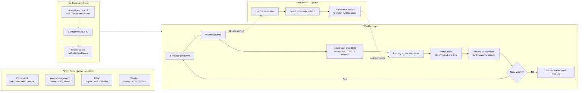
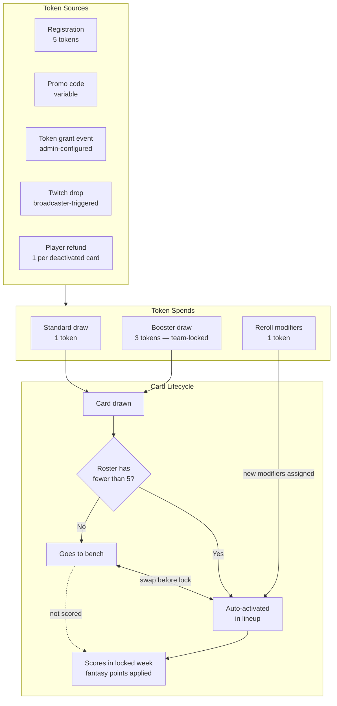

# Plan: Mermaid Process Documentation

## Context
Contributors and operators currently have no visual overview of how the Fantasy League system
fits together — the lifecycle of a season, how tokens flow, or which admin actions happen at
which stage. Mermaid diagrams embedded in Markdown render natively on GitHub and are
maintainable alongside the code. This plan creates a single reference page
(`markdown/process-diagrams.md`) containing three diagrams: the season lifecycle, the token
and card economy, and an admin tools overview. The page is then linked from
`markdown/features/README.md` and the main `README.md`. *Resolves GitHub issue #72.*

## User Stories

### View a Season Lifecycle Diagram
**User story**
As a new contributor or operator, I want to see a single visual diagram of the season
lifecycle so that I can understand the pre-season setup and the recurring weekly loop without
reading all the source files.

**Acceptance criteria**
- A Mermaid `flowchart LR` diagram exists in `markdown/process-diagrams.md`
- It shows a distinct pre-season phase (player pool setup, league configuration, week creation)
- It shows the during-season weekly loop (ingest → score → lock → roster snapshot → repeat)
- It shows the MVP flow from Twitch stream through bonus application
- Admin tools are shown as a side group, not inline with the main flow

---

### View the Token and Card Economy Diagram
**User story**
As a developer working on scoring or draw logic, I want a visual map of all token sources and
sinks and the card lifecycle so that I can trace how tokens move through the system.

**Acceptance criteria**
- A second Mermaid diagram on the same page shows all token sources (initial allocation,
  promo code, token grant event, Twitch drop, player refund)
- It shows all token sinks (standard draw, booster draw, reroll)
- It shows the card lifecycle after a draw (activate vs bench, weekly scoring, swap window)
- The diagram is accurate — all sources and sinks match the current implementation

---

### Find Process Diagrams from the Documentation Index
**User story**
As any reader of the docs, I want the process diagrams to be discoverable from the main
documentation entry points so that I do not have to know they exist to find them.

**Acceptance criteria**
- `markdown/features/README.md` includes a link to `process-diagrams.md`
- The main `README.md` documentation section also links to `markdown/process-diagrams.md`
- The page title and file name are descriptive enough to be findable by search

---

## Implementation

### Critical Files
| File | Change |
|---|---|
| `markdown/process-diagrams.md` | New file — contains all three Mermaid diagrams |
| `markdown/features/README.md` | Add link to process-diagrams in the Reference table |
| `README.md` | Add link in the documentation section |

### Step 1 — Create `markdown/process-diagrams.md`

The file contains three sections with embedded Mermaid diagrams.

#### Diagram 1: Season Lifecycle



#### Diagram 2: Token and Card Economy



### Step 2 — Update `markdown/features/README.md`

Add a row at the top of the Reference tier table:

```markdown
| [Process Diagrams](../process-diagrams.md) | Mermaid flowcharts: season lifecycle, token/card economy, admin tools overview |
```

### Step 3 — Update `README.md`

Add a link in the documentation section alongside the existing `markdown/features/` link:

```markdown
- [Process Diagrams](markdown/process-diagrams.md) — visual flowcharts of the season lifecycle and token/card economy
```

---

## Verification
- Open `markdown/process-diagrams.md` on GitHub — all three diagrams render without syntax errors
- The season lifecycle diagram shows pre-season → weekly loop → season end, with admin tools and Twitch as side groups
- The token diagram correctly lists all five token sources and three spend types from the current implementation
- Both `markdown/features/README.md` and `README.md` link to the file
- Running `grep -r "process-diagrams" markdown/` returns at least two files (README and features/README)
