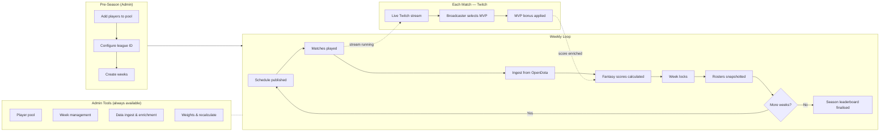
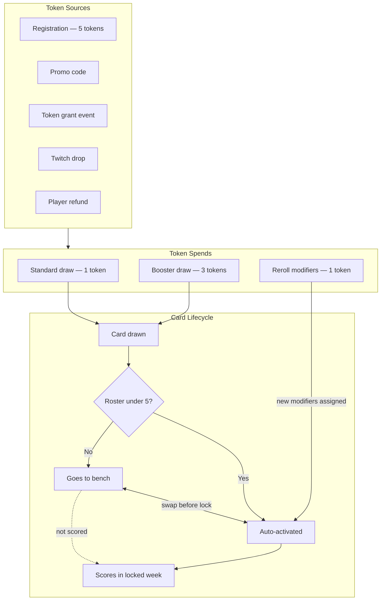
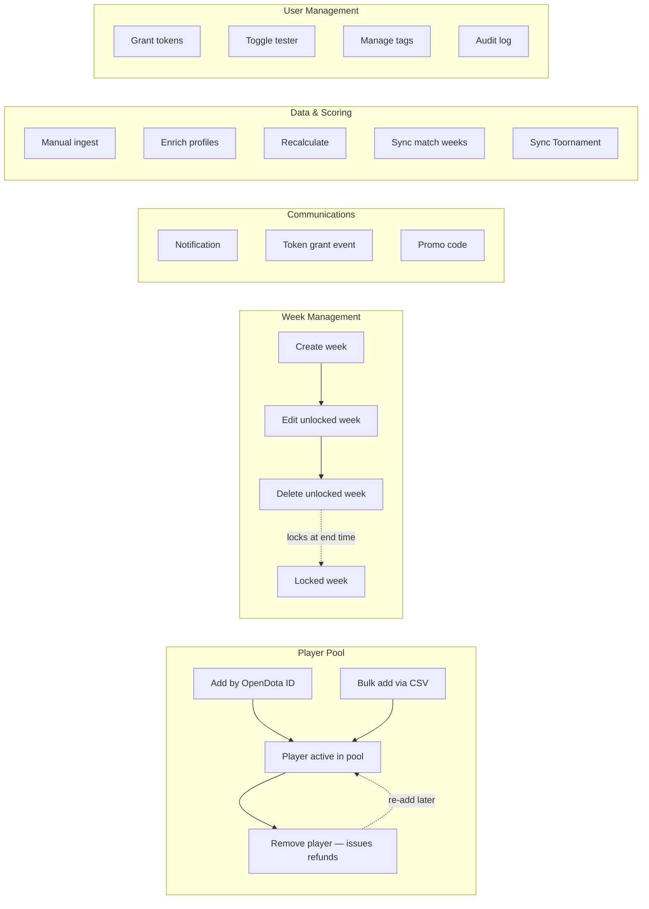

# Process Diagrams

Visual overviews of the Fantasy League system. All diagrams use [Mermaid](https://mermaid.js.org/) and render natively on GitHub.

---

## Season Lifecycle

Shows the full arc of a season: pre-season admin setup, the recurring weekly loop, and how the Twitch MVP flow connects to match scoring. Admin tools are shown as a side group — they are available throughout the season, not only at a specific stage.

---

## Token and Card Economy

Maps every token source and spend in the system, then traces what happens to a card after it is drawn.

---

## Admin Tools Overview

All admin actions available in the admin tab. These operate independently of the weekly schedule.

